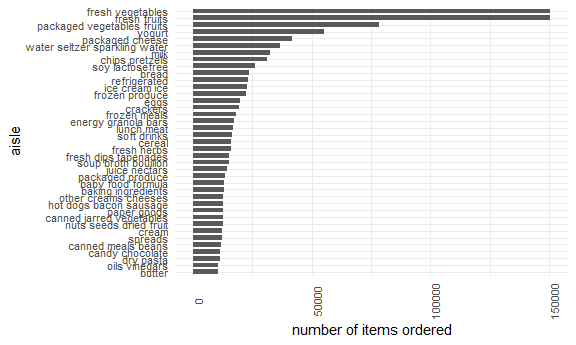

p8105\_hw3\_dtw2127
================
Dee Wang
18/10/2021

First we’ll load in the instacart data and do an exploration of the
dataset.

``` r
data("instacart")

str(instacart)
```

    ## tibble [1,384,617 x 15] (S3: tbl_df/tbl/data.frame)
    ##  $ order_id              : int [1:1384617] 1 1 1 1 1 1 1 1 36 36 ...
    ##  $ product_id            : int [1:1384617] 49302 11109 10246 49683 43633 13176 47209 22035 39612 19660 ...
    ##  $ add_to_cart_order     : int [1:1384617] 1 2 3 4 5 6 7 8 1 2 ...
    ##  $ reordered             : int [1:1384617] 1 1 0 0 1 0 0 1 0 1 ...
    ##  $ user_id               : int [1:1384617] 112108 112108 112108 112108 112108 112108 112108 112108 79431 79431 ...
    ##  $ eval_set              : chr [1:1384617] "train" "train" "train" "train" ...
    ##  $ order_number          : int [1:1384617] 4 4 4 4 4 4 4 4 23 23 ...
    ##  $ order_dow             : int [1:1384617] 4 4 4 4 4 4 4 4 6 6 ...
    ##  $ order_hour_of_day     : int [1:1384617] 10 10 10 10 10 10 10 10 18 18 ...
    ##  $ days_since_prior_order: int [1:1384617] 9 9 9 9 9 9 9 9 30 30 ...
    ##  $ product_name          : chr [1:1384617] "Bulgarian Yogurt" "Organic 4% Milk Fat Whole Milk Cottage Cheese" "Organic Celery Hearts" "Cucumber Kirby" ...
    ##  $ aisle_id              : int [1:1384617] 120 108 83 83 95 24 24 21 2 115 ...
    ##  $ department_id         : int [1:1384617] 16 16 4 4 15 4 4 16 16 7 ...
    ##  $ aisle                 : chr [1:1384617] "yogurt" "other creams cheeses" "fresh vegetables" "fresh vegetables" ...
    ##  $ department            : chr [1:1384617] "dairy eggs" "dairy eggs" "produce" "produce" ...
    ##  - attr(*, "spec")=
    ##   .. cols(
    ##   ..   order_id = col_integer(),
    ##   ..   product_id = col_integer(),
    ##   ..   add_to_cart_order = col_integer(),
    ##   ..   reordered = col_integer(),
    ##   ..   user_id = col_integer(),
    ##   ..   eval_set = col_character(),
    ##   ..   order_number = col_integer(),
    ##   ..   order_dow = col_integer(),
    ##   ..   order_hour_of_day = col_integer(),
    ##   ..   days_since_prior_order = col_integer(),
    ##   ..   product_name = col_character(),
    ##   ..   aisle_id = col_integer(),
    ##   ..   department_id = col_integer(),
    ##   ..   aisle = col_character(),
    ##   ..   department = col_character()
    ##   .. )

The instacart dataset contains 1384617 rows of data for 15 variables.
Key variables include order ID, product ID, add to cart order, user ID,
order hour of day, days since prior order, and department.

There are 134 aisles. Let’s determine which aisle the most items are
ordered from.

``` r
instacart %>% group_by(aisle, aisle_id) %>% summarize(n_obs = n()) %>% arrange(desc(n_obs)) 
```

    ## `summarise()` has grouped output by 'aisle'. You can override using the `.groups` argument.

    ## # A tibble: 134 x 3
    ## # Groups:   aisle [134]
    ##    aisle                         aisle_id  n_obs
    ##    <chr>                            <int>  <int>
    ##  1 fresh vegetables                    83 150609
    ##  2 fresh fruits                        24 150473
    ##  3 packaged vegetables fruits         123  78493
    ##  4 yogurt                             120  55240
    ##  5 packaged cheese                     21  41699
    ##  6 water seltzer sparkling water      115  36617
    ##  7 milk                                84  32644
    ##  8 chips pretzels                     107  31269
    ##  9 soy lactosefree                     91  26240
    ## 10 bread                              112  23635
    ## # ... with 124 more rows

The most items are ordered from the fresh vegetables, fresh fruits, and
packaged vegetables and fruits aisle.

We’ll make a plot that shows the number of items ordered from each
aisle.

``` r
instacart %>% group_by(aisle, department) %>% summarize(n_obs = n()) %>% filter(n_obs > 10000) %>% arrange(department) %>% 
  ggplot(aes(x = aisle, y = n_obs)) + 
  geom_bar(stat = "identity") +
  theme(axis.text.x = element_text(angle = 90))
```

    ## `summarise()` has grouped output by 'aisle'. You can override using the `.groups` argument.



Next we’ll create a table showing the three most popular items in each
of the aisles “baking ingredients”, “dog food care”, and “packaged
vegetables fruits”.

``` r
instacart %>% filter(aisle == c("baking ingredients", "packaged vegetables fruits", "dog food care")) %>% group_by(aisle, product_name) %>% summarize(n_obs = n()) %>% slice_max(order_by = n_obs, n = 3) %>% knitr::kable()
```

    ## `summarise()` has grouped output by 'aisle'. You can override using the `.groups` argument.

| aisle                      | product\_name                                                      | n\_obs |
|:---------------------------|:-------------------------------------------------------------------|-------:|
| baking ingredients         | Light Brown Sugar                                                  |    157 |
| baking ingredients         | Pure Baking Soda                                                   |    140 |
| baking ingredients         | Organic Vanilla Extract                                            |    122 |
| dog food care              | Snack Sticks Chicken & Rice Recipe Dog Treats                      |     15 |
| dog food care              | Dog Food With Beef in Meaty Juices                                 |      9 |
| dog food care              | Beef Stew Canned Dog Food                                          |      8 |
| dog food care              | Chicken & Vegetable Snack Sticks for Dogs                          |      8 |
| dog food care              | Dog Snacks, Medium                                                 |      8 |
| dog food care              | Organix Butcher & Bushel Grain-Free Turkey Dinner Canned Dog Food  |      8 |
| dog food care              | Organix Chicken & Brown Rice Recipe                                |      8 |
| dog food care              | Premium Dog Treats Peanut Butter Flavor, Medium Size               |      8 |
| dog food care              | Select Tender Chicken with Vegetables & Brown Rice Dog Food Recipe |      8 |
| dog food care              | Standard Size Pet Waste bags                                       |      8 |
| dog food care              | Strips Bacon Flavor Bacon Dog Snacks                               |      8 |
| packaged vegetables fruits | Organic Baby Spinach                                               |   3219 |
| packaged vegetables fruits | Organic Raspberries                                                |   1882 |
| packaged vegetables fruits | Organic Blueberries                                                |   1634 |

``` r
instacart %>% filter(aisle == c("baking ingredients")) %>% group_by(product_name) %>% summarize(n_obs = n()) %>% slice_max(order_by = n_obs, n = 3) %>% knitr::kable()
```

| product\_name     | n\_obs |
|:------------------|-------:|
| Light Brown Sugar |    499 |
| Pure Baking Soda  |    387 |
| Cane Sugar        |    336 |

``` r
instacart %>% filter(aisle == c("packaged vegetables fruits")) %>% group_by(product_name) %>% summarize(n_obs = n()) %>% slice_max(order_by = n_obs, n = 3) %>% knitr::kable()
```

| product\_name        | n\_obs |
|:---------------------|-------:|
| Organic Baby Spinach |   9784 |
| Organic Raspberries  |   5546 |
| Organic Blueberries  |   4966 |

``` r
instacart %>% filter(aisle == c("dog food care")) %>% group_by(product_name) %>% summarize(n_obs = n()) %>% slice_max(order_by = n_obs, n = 3) %>% knitr::kable()
```

| product\_name                                 | n\_obs |
|:----------------------------------------------|-------:|
| Snack Sticks Chicken & Rice Recipe Dog Treats |     30 |
| Organix Chicken & Brown Rice Recipe           |     28 |
| Small Dog Biscuits                            |     26 |

Next we’ll make a table showing the mean hour of the day at which Pink
Lady Apples and Coffee Ice Cream are ordered on each day of the week and
will format the table for human readers.

``` r
instacart %>% 
  filter(product_name == c("Pink Lady Apples", "Coffee Ice Cream")) %>% 
  group_by(order_dow, product_name) %>% 
  summarize(mean_hour_of_day = mean(order_hour_of_day)) %>% 
  pivot_wider(
    names_from = product_name, 
    values_from = mean_hour_of_day) %>% 
  knitr::kable(digits = 1)
```

    ## Warning in product_name == c("Pink Lady Apples", "Coffee Ice Cream"): longer
    ## object length is not a multiple of shorter object length

    ## `summarise()` has grouped output by 'order_dow'. You can override using the `.groups` argument.

| order\_dow | Coffee Ice Cream | Pink Lady Apples |
|-----------:|-----------------:|-----------------:|
|          0 |             13.2 |             12.2 |
|          1 |             15.0 |             11.7 |
|          2 |             15.3 |             12.0 |
|          3 |             15.4 |             13.9 |
|          4 |             15.2 |             11.9 |
|          5 |             10.3 |             13.9 |
|          6 |             12.4 |             11.6 |
