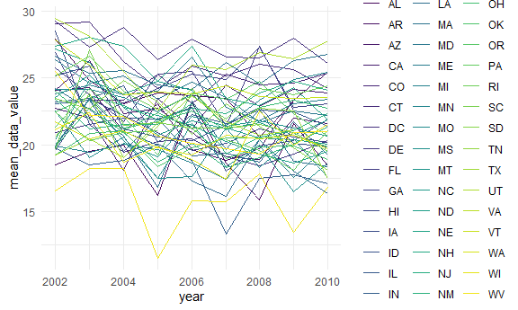

p8105\_hw3\_dtw2127
================
Dee Wang
18/10/2021

First we’ll load in the instacart data and do an exploration of the
dataset.

``` r
data("instacart")
```

The instacart dataset contains 1384617 rows of data for 15 variables.
Key variables include order ID, product ID, add to cart order, user ID,
order hour of day, days since prior order, and department.

The dataset contains information from 131209 users.

Let’s see how many different products are carried by each department.

``` r
instacart %>% 
  group_by(department) %>% 
  summarize(n_products = n_distinct(product_name)) %>% 
  arrange(desc(n_products))
```

    ## # A tibble: 21 x 2
    ##    department      n_products
    ##    <chr>                <int>
    ##  1 snacks                5020
    ##  2 personal care         4314
    ##  3 pantry                4107
    ##  4 beverages             3526
    ##  5 frozen                3414
    ##  6 dairy eggs            3033
    ##  7 household             2327
    ##  8 canned goods          1715
    ##  9 produce               1533
    ## 10 dry goods pasta       1526
    ## # ... with 11 more rows

The snacks department carries the most number of different products,
while the bulk department carries the least.

Let’s see which day of the week is most popular for orders.

``` r
instacart %>% 
  mutate(order_dow = recode(order_dow, `0` = "Sunday", 
                            `1` = "Monday", 
                            `2` = "Tuesday", 
                            `3` = "Wednesday", 
                            `4` = "Thursday", 
                            `5` = "Friday", 
                            `6` = "Saturday")) %>%
  group_by(order_dow) %>%
  summarize(n_orders = n_distinct(order_id)) %>% 
  arrange(desc(n_orders))
```

    ## # A tibble: 7 x 2
    ##   order_dow n_orders
    ##   <chr>        <int>
    ## 1 Sunday       27465
    ## 2 Monday       19672
    ## 3 Saturday     18901
    ## 4 Friday       17406
    ## 5 Tuesday      16119
    ## 6 Thursday     15959
    ## 7 Wednesday    15687

Sundays are the most popular days for orders, followed by Monday.

There are 134 aisles. Let’s determine which aisle the most items are
ordered from.

``` r
instacart %>% 
  group_by(aisle) %>% 
  summarize(n_obs = n()) %>% 
  slice_max(n_obs, n=3) %>%
  knitr::kable()
```

| aisle                      | n\_obs |
|:---------------------------|-------:|
| fresh vegetables           | 150609 |
| fresh fruits               | 150473 |
| packaged vegetables fruits |  78493 |

The most items are ordered from the fresh vegetables, fresh fruits, and
packaged vegetables and fruits aisle.

We’ll make a plot that shows the number of items ordered from each
aisle.

``` r
instacart %>% 
  group_by(aisle, department) %>% 
  summarize(n_obs = n()) %>% filter(n_obs > 10000) %>% 
  ggplot(aes(x = forcats::fct_reorder(aisle, n_obs), y = n_obs)) +
  geom_bar(stat = "identity", width = 0.7, position = "dodge") + 
  theme(axis.text.x = element_text(angle = 90)) +
  labs(x = "aisle", y = "number of items ordered") + 
  coord_flip()
```

    ## `summarise()` has grouped output by 'aisle'. You can override using the `.groups` argument.


``` r
#arrange bars in ascending order
```

Next we’ll create a table showing the three most popular items in each
of the aisles “baking ingredients”, “dog food care”, and “packaged
vegetables fruits”.

``` r
instacart %>% 
  filter(aisle %in% c("baking ingredients", 
                      "packaged vegetables fruits", 
                      "dog food care")) %>% 
  group_by(aisle, product_name) %>% 
  summarize(n_obs = n()) %>% 
  slice_max(order_by = n_obs, n = 3) %>% 
  knitr::kable()
```

    ## `summarise()` has grouped output by 'aisle'. You can override using the `.groups` argument.

| aisle                      | product\_name                                 | n\_obs |
|:---------------------------|:----------------------------------------------|-------:|
| baking ingredients         | Light Brown Sugar                             |    499 |
| baking ingredients         | Pure Baking Soda                              |    387 |
| baking ingredients         | Cane Sugar                                    |    336 |
| dog food care              | Snack Sticks Chicken & Rice Recipe Dog Treats |     30 |
| dog food care              | Organix Chicken & Brown Rice Recipe           |     28 |
| dog food care              | Small Dog Biscuits                            |     26 |
| packaged vegetables fruits | Organic Baby Spinach                          |   9784 |
| packaged vegetables fruits | Organic Raspberries                           |   5546 |
| packaged vegetables fruits | Organic Blueberries                           |   4966 |

The most popular items in the baking ingredients aisle are light brown
sugar, pure baking soda and cane sugar. The most popular items in the
dog food care aisle are snack sticks chicken & rice recipe dog treats,
organic chicken & brown rice recipe, and small dog biscuits. The most
popular items in the packaged vegetables fruits aisle are organic baby
spinach, raspberries and blueberries.

Next we’ll make a table showing the mean hour of the day at which Pink
Lady Apples and Coffee Ice Cream are ordered on each day of the week and
will format the table for human readers.

``` r
instacart %>% 
  filter(product_name %in% c("Pink Lady Apples", "Coffee Ice Cream")) %>% 
  mutate(order_dow = recode(order_dow, `0` = "Sunday", 
                            `1` = "Monday", 
                            `2` = "Tuesday", 
                            `3` = "Wednesday", 
                            `4` = "Thursday", 
                            `5` = "Friday", 
                            `6` = "Saturday")) %>%
  mutate(order_dow = factor(order_dow, levels = c("Sunday", "Monday", "Tuesday", "Wednesday", "Thursday", "Friday", "Saturday"))) %>% 
  group_by(order_dow, product_name) %>% 
  summarize(mean_hour_of_day = mean(order_hour_of_day)) %>% 
  pivot_wider(
    names_from = order_dow, 
    values_from = mean_hour_of_day) %>% 
  knitr::kable(digits = 1)
```

    ## `summarise()` has grouped output by 'order_dow'. You can override using the `.groups` argument.

| product\_name    | Sunday | Monday | Tuesday | Wednesday | Thursday | Friday | Saturday |
|:-----------------|-------:|-------:|--------:|----------:|---------:|-------:|---------:|
| Coffee Ice Cream |   13.8 |   14.3 |    15.4 |      15.3 |     15.2 |   12.3 |     13.8 |
| Pink Lady Apples |   13.4 |   11.4 |    11.7 |      14.2 |     11.6 |   12.8 |     11.9 |

## Problem 2

First, let’s load in the BRFSS data and then do some data cleaning.

``` r
data("brfss_smart2010") #rename some of the variables

brfss = brfss_smart2010 %>% 
  janitor::clean_names() %>% 
  mutate(topic = as.factor(topic)) %>%
  filter(topic == "Overall Health") %>%
  mutate(response = as.factor(response)) %>% 
  mutate(response = factor(response, levels = c("Poor", "Fair", "Good", "Very Good", "Excellent")))
```

Let’s determine how many states were observed at 7 or more locations in
2002 and 2010.

``` r
brfss %>% 
  filter(year %in% c(2002, 2010)) %>% 
  select(locationabbr, geo_location, year) %>% 
  distinct() %>% 
  group_by(locationabbr, year) %>% 
  summarize(n_obs = n()) %>%
  filter(n_obs >= 7) %>% 
  arrange(year)
```

    ## `summarise()` has grouped output by 'locationabbr'. You can override using the `.groups` argument.

    ## # A tibble: 20 x 3
    ## # Groups:   locationabbr [15]
    ##    locationabbr  year n_obs
    ##    <chr>        <int> <int>
    ##  1 CT            2002     7
    ##  2 FL            2002     7
    ##  3 MA            2002     8
    ##  4 NC            2002     7
    ##  5 NJ            2002     8
    ##  6 PA            2002    10
    ##  7 CA            2010    12
    ##  8 CO            2010     7
    ##  9 FL            2010    41
    ## 10 MA            2010     9
    ## 11 MD            2010    12
    ## 12 NC            2010    12
    ## 13 NE            2010    10
    ## 14 NJ            2010    19
    ## 15 NY            2010     9
    ## 16 OH            2010     8
    ## 17 PA            2010     7
    ## 18 SC            2010     7
    ## 19 TX            2010    16
    ## 20 WA            2010    10

In 2002, CT, FL, MA, NC, NJ and PA were observed at 7 or more locations.

In 2010, CA, CO, FL, MA, MD, NC, NE, NJ, NY, OH, PA, SC, TX, WA were
observed at 7 or more locations.

Next, we will construct a dataset limited to ‘Excellent’ responses and
containing year, state and a variable averaging data\_value across
locations within a state, and we’ll make a spaghetti plot of the average
value over time.

``` r
brfss %>%
  filter(response == "Excellent") %>% 
  group_by(locationabbr, year) %>% 
  mutate(mean_data_value = mean(data_value)) %>% 
  select(year, locationabbr, mean_data_value) %>% 
  ggplot(aes(x = year, y = mean_data_value, color = locationabbr)) + 
  geom_line(aes(group = locationabbr)) +
  theme(legend.position = "right")
```

    ## Warning: Removed 65 row(s) containing missing values (geom_path).



The majority of mean data values are under 30.

Next, we’ll make a two-panel plot showing the distribution of
data\_value for responses (“Poor” to “Excellent”) for 2006 and 2010
among locations in NY State.

``` r
brfss %>% 
  filter(response %in% c("Poor", "Fair", "Good",
                         "Very Good", "Excellent"),
         year %in% c(2006,2010)) %>% 
  group_by(locationabbr, geo_location) %>% 
  ggplot(aes(x = response, y = data_value)) + 
  geom_point(size = .5) + 
  facet_grid(. ~ year)
```

    ## Warning: Removed 7 rows containing missing values (geom_point).


``` r
brfss %>% 
  filter(response %in% c("Poor", "Fair", "Good",
                         "Very Good", "Excellent"),
         year %in% c(2006,2010)) %>% 
  group_by(locationabbr, geo_location) %>% 
  ggplot(aes(x = data_value, fill = response)) + 
  geom_density(alpha = .4, adjust = .5, color = "blue") + 
  facet_grid(. ~ year)
```

    ## Warning: Removed 7 rows containing non-finite values (stat_density).


\#\# Problem 3

Let’s load in and tidy the data.

``` r
accel_data = read_csv("./data/accel_data.csv") %>%
  janitor::clean_names() %>% 
  pivot_longer(
    activity_1:activity_1440, 
    names_to = "activity", 
    names_prefix = "activity_",
    values_to = "activity_count") %>% 
  mutate(weekend = ifelse(day %in% c("Saturday", "Sunday"), 1, 0), 
         activity = as.numeric(activity), 
         weekend = as.factor(weekend)) 
```

    ## Rows: 35 Columns: 1443

    ## -- Column specification --------------------------------------------------------
    ## Delimiter: ","
    ## chr    (1): day
    ## dbl (1442): week, day_id, activity.1, activity.2, activity.3, activity.4, ac...

    ## 
    ## i Use `spec()` to retrieve the full column specification for this data.
    ## i Specify the column types or set `show_col_types = FALSE` to quiet this message.

The resulting dataset has the variables week, day\_id, day, activity,
activity\_count and weekend. For these 6 variables, there are
`nrow(accel_data)` observations.

Next we’ll aggregate minutes of activity over each day and create a
table with the totals.

``` r
accel_data %>% 
  group_by(day_id) %>% 
  summarize(activity_total = sum(activity_count)) %>% 
  knitr::kable()
```

| day\_id | activity\_total |
|--------:|----------------:|
|       1 |       480542.62 |
|       2 |        78828.07 |
|       3 |       376254.00 |
|       4 |       631105.00 |
|       5 |       355923.64 |
|       6 |       307094.24 |
|       7 |       340115.01 |
|       8 |       568839.00 |
|       9 |       295431.00 |
|      10 |       607175.00 |
|      11 |       422018.00 |
|      12 |       474048.00 |
|      13 |       423245.00 |
|      14 |       440962.00 |
|      15 |       467420.00 |
|      16 |       685910.00 |
|      17 |       382928.00 |
|      18 |       467052.00 |
|      19 |       371230.00 |
|      20 |       381507.00 |
|      21 |       468869.00 |
|      22 |       154049.00 |
|      23 |       409450.00 |
|      24 |         1440.00 |
|      25 |       260617.00 |
|      26 |       340291.00 |
|      27 |       319568.00 |
|      28 |       434460.00 |
|      29 |       620860.00 |
|      30 |       389080.00 |
|      31 |         1440.00 |
|      32 |       138421.00 |
|      33 |       549658.00 |
|      34 |       367824.00 |
|      35 |       445366.00 |

``` r
accel_data %>% 
  group_by(day_id) %>% 
  summarize(activity_total = sum(activity_count)) %>% 
  ggplot(aes(day_id, activity_total)) + 
  geom_point()
```


``` r
accel_data %>% 
  group_by(day_id) %>% 
  summarize(activity_total = sum(activity_count)) %>%
  max()
```

    ## [1] 685910

6.8591^{5}

Finally, we will create a plot showing 24 hour activity time courses for
each day.

``` r
accel_data %>% 
  #group_by(day_id) %>% 
  ggplot(aes(x = activity, y = activity_count)) + 
  geom_line(aes(color = day), size = .3, alpha = 0.4) + 
  scale_colour_manual(values = rainbow(7)) 
```


There is a general upward trend in activity counts.
